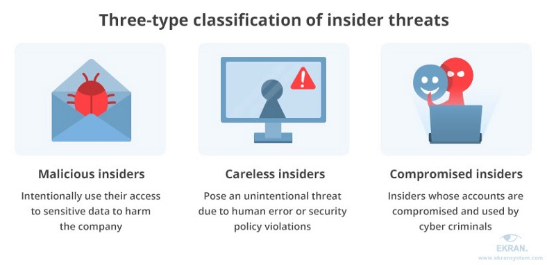

# ***Machine Learning and its use cases in Cybersecurity***

### ***What is machine learning ?***
Machine learning is a subset of artificial intelligence (AI) that takes some inputs (called Training) then applies advanced algorithms, statistical and mathematical models to predict an outcome. There are several types of machine learning systems based on what algorithm or data processing technique used, such as:

✔ Supervised  
✔ Unsupervised  
✔ Reinforced learning  
✔ Bayesian network  
✔ Neural Network  
✔ Generative adversarial network (GAN)  
✔ Association rule learning And other  

They all have unique use cases, but the premise is basically the same: inference and optimization — that is, how well can you predict something based on what occurred already

## ***Machine Learning in Cybersecurity***

The role of Machine Learning in protecting people’s data in a digital world is growing all the time. Machine Learning is capable of constantly analyzing immense amounts of data in order to detect any kind of malware, threats or virus that could indicate a security breach, then take necessary steps to protect against them.

There are wide scale benefits of Machine Learning for business operations enhance the security of data with fast and effective monitoring and prevention of cybersecurity breaches. Without Machine Learning, cybersecurity programs take time to catch and resolve. Security experts can’t monitor systems on the scale that Machine Learning AI can

Now in this time where data is our business cyber attacks occur with higher frequency and may cause more damage to the business. With Machine Learning under the supervision of expert analysts, the time it takes to catch and prevent attacks can be reduced to a much shorter extent.

Threats in the digital world evolve so quickly that no amount of training and manpower can effectively catch them all. But cybersecurity protections through Machine Learning can use the vast amounts of data put into them to develop better and better understandings of a system over time and adapt to better protect vulnerable data.

### ***Using Machine Learning for Insider threats and Behavioral Analysis to Assist with Threat Detection***

Employees, vendors, contractors and suppliers who have access to your organizations are insiders. Any threat caused by them are insider threats. What makes them dangerous is, being in your trusted circles, they can cause the most damage. Another major issue is, these threats are hard to detect. You can’t use traditional security measures like implementing white-list/black-list, blocking access, IP-filtering, patching system, adding firewall, intrusion detection etc. to thwart such threats. These systems are designed to keep the bad guys out. Naturally, they can’t do much when the danger is already inside. Dealing with insider threats requires a different strategy.

An effective way to deal with insider threats is to monitor user activities and identify behavioral anomalies, some of which might have malicious intent. That’s why vendors in security and risk management space are increasingly focusing on behavioral analysis techniques to develop their Insider Threat Prevention solutions. Modern employee/user activity monitoring (UAM), user & entity behavior analytics (UEBA), data loss prevention (DLP) etc. — all have started using some form of behavioral analytics feature. A few of the modern ones have started to adapt Machine Learning (ML) and AI to go beyond analytics and create intelligent, expert solutions.

#### ***Here are a few advantages of machine learning algorithms when used to detect insider threats:***

***Supervision:***
Machine learning leads to automation reducing the need for manual supervision. Once set up, the system can take care of most of the tasks involving discovery and classification and, in some cases, even respond to potential harmful user behaviors automatically.

***Scalability:***
ML can handle large amounts of data from multiple sources making it suitable for large deployments. In fact, the larger the dataset, the better the system can ‘learn’.

***Establish correlation & regression:***
ML can find and classify data at speed and efficiency a human can’t. It’s also very good at finding signals from the noise — which makes it suitable for the task of separating abnormal user behavior from their normal activities.

***Reduced number of false positives:***
False positives occur when a security system misrepresents a harmless action as malicious. It’s a major concern among security professionals as they are a major cause of wasted time and effort. If enough of these occur, your security team will get overwhelmed. A more dangerous scenario is, when your security team keeps receiving the same false alerts, starts ignoring them, and an actual threat slips through. Machine learning can help prevent such scenarios. It uses several techniques like Decision Tree, Rule-Based Classification, Self-Organizing Maps, Clustering etc. to reduce false positives and still provide a solid security coverage.

***Faster detection and response time:***
With today’s optimized models and hardware, machine learning can make high speed risk analysis and anomaly detection in large volumes of data. As a result, you can respond to threats faster and better.

***Continuous improvement:***
This is probably one of the most attractive benefits of using machine learning in security applications. A self-evolving ML model/deep learning can improve as it processes more cases and takes feedback from human supervisors over time. Also, machine learning is an emerging technology and everyday improvements are made in this field. Which is good because the threat landscape is evolving and we need a solution that can keep pace with it.

> ***So as the threat landscape evolves, we need technologies that can adjust to dynamic insider threats such as malicious users, sabotage, espionage, frauds, data and IP theft, privilege misuse and other difficult to identify risks. Machine learning seems to be a promising technology moving in the right direction***

### Thankyou For Reading : )
### Any query and suggestion are always welcome — [Gaurav Pagare](https://www.linkedin.com/in/gaurav-pagare-8b721a193/)
